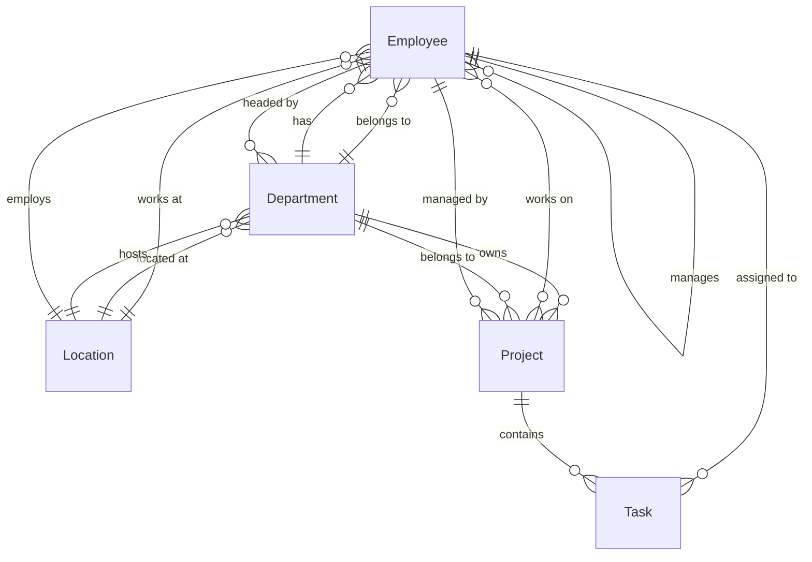

## 📘 Employee Management System (Frontend - Angular)

### 🛠 Tech Stack
- **Framework**: Angular 19.0.5
- **Language**: TypeScript
- **Runtime**: Node.js (latest LTS)
- **Dev Server**: Angular CLI (ng serve)

### 📊 Frontend Data Models

#### Core Interfaces

1. **Employee**
   ```typescript
   interface Employee {
     id: string;
     firstName: string;
     lastName: string;
     email: string;
     phone: string;
     address: string;
     designation: string;
     salary: number;
     joiningDate: string;
     locationId: string;
     performanceRating: number;
     managerId: string | null;
     departmentId: string;
     workLocation: string;
     experienceYears: number;
   }
   ```

2. **Department**
   ```typescript
   interface Department {
     id: string;
     name: string;
     description: string;
     locationId: string;
     createdAt: string;
     budget: number;
     budgetUtilization: number;
     performanceMetric: number;
     departmentHeadId: string;
     locationName: string;
     totalEmployees: number;
   }
   ```

3. **Location**
   ```typescript
   interface Location {
     id: string;
     name: string;
     address: string;
     city: string;
     state: string;
     country: string;
     postalCode: string;
   }
   ```

4. **Project**
   ```typescript
   interface Project {
     id: string;
     name: string;
     description: string;
     startDate: string;
     endDate: string;
     status: string;
     budget: number;
     departmentId: string;
     projectManagerId: string;
   }
   ```

5. **EmployeeProject**
   ```typescript
   interface EmployeeProject {
     employeeId: string;
     projectId: string;
     role: string;
     assignedDate: string;
   }
   ```

6. **Task**
   ```typescript
   interface Task {
     id: string;
     name: string;
     description: string;
     status: string;
     priority: string;
     startDate: string;
     dueDate: string;
     completedDate: string;
     projectId: string;
     assignedToId: string;
   }
   ```

#### Data Model Relationships



#### Key Features
- Type-safe interfaces for all entities
- Proper null handling for optional fields
- Consistent ID types (string for UUID)
- Date fields as ISO strings for easy serialization
- Denormalized fields for performance (e.g., `locationName` in Department)
- Clear separation between entity and DTO types
- Proper handling of self-referential relationships (Employee management)

#### Type Guards and Utilities
```typescript
// Type guard for Employee
function isEmployee(value: unknown): value is Employee {
  return typeof value === 'object' && value !== null &&
    'firstName' in value && 'lastName' in value;
}

// Type guard for Department
function isDepartment(value: unknown): value is Department {
  return typeof value === 'object' && value !== null &&
    'name' in value && 'locationId' in value;
}

// Type guard for Project
function isProject(value: unknown): value is Project {
  return typeof value === 'object' && value !== null &&
    'name' in value && 'departmentId' in value;
}
```

---

### 🚀 Local Development Setup

#### 📋 Prerequisites
- Node.js & npm
- Angular CLI (`npm install -g @angular/cli`)

#### 📁 Setup Steps
1. Clone the frontend repository:
   ```bash
   git clone <frontend-repo-url>
   cd employee-management-system-gui
   ```

2. Install dependencies:
   ```bash
   npm install
   ```

3. Verify proxy configuration (for local development to communicate with EC2 backend):
   Create `proxy.conf.json` if not already present:
   ```json
   {
     "/api/*": {
       "target": "http://<EC2-PUBLIC-IP>:8080",
       "secure": false,
       "logLevel": "debug",
       "changeOrigin": true,
       "pathRewrite": {
         "^/api": ""
       }
     }
   }
   ```
   > Replace `<EC2-PUBLIC-IP>` with the actual public IP of your EC2 instance.

4. Ensure `angular.json` includes:
   ```json
   "serve": {
     "options": {
       "proxyConfig": "proxy.conf.json"
     }
   }
   ```

5. Configure HttpClient in `app.config.ts`:
   ```typescript
   import { provideHttpClient, withFetch, withInterceptorsFromDi } from '@angular/common/http';

   export const appConfig: ApplicationConfig = {
     providers: [
       // ... other providers
       provideHttpClient(withFetch(), withInterceptorsFromDi()),
     ],
   };
   ```

6. Run the frontend:
   ```bash
   npm run start:dev
   ```
   Access at: [http://localhost:4200](http://localhost:4200)

---

### 🌍 Environment Configuration
#### environment.ts (for development)
```ts
export const environment = {
  production: false,
  apibaseurl: '/api'
};
```

#### environment.prod.ts (for future S3/Cloud deployment)
```ts
export const environment = {
  production: true,
  apibaseurl: 'http://<EC2-PUBLIC-IP>:8080' // Replace with your EC2 IP
};
```

---

## 🧪 API Testing
Use Postman or curl:
```bash
curl http://<EC2-PUBLIC-IP>:8080/departments
```

Make sure EC2 security group allows port 8080 from your IP (or 0.0.0.0/0 for testing).

---

## ☁️ Troubleshooting
| Issue | Reason | Fix |
|-------|--------|-----|
| CORS Error | CORS not configured properly in Spring Boot | Ensure EC2 IP & localhost are in `spring.web.cors.allowed-origins` |
| Timeout | Security group blocking | Add port 8080 rule in inbound settings for your IP |
| 500 Internal Server Error | Misconfigured backend or invalid payload | Check backend logs using `tail -f app.log` |
| NullInjectorError for HttpClient | Missing HttpClient provider in standalone components | Add `provideHttpClient(withFetch(), withInterceptorsFromDi())` to app.config.ts providers |
| HTTP Client not working in standalone components | Incorrect HttpClient configuration | Ensure HttpClient is properly configured in app.config.ts and components |

---

## 📦 Scripts Summary
| Command | Description |
|---------|-------------|
| `npm start` | Runs `ng serve` with proxy config |
| `npm run start:dev` | Development mode with proxy (to EC2 backend) |
| `npm run clean` | Deletes `dist/` build |

---

## 🔧 Common Issues and Solutions

### HttpClient Configuration
When using standalone components with HttpClient, you might encounter the following error:
```
ERROR Error [NullInjectorError]: R3InjectorError(Standalone[_Component])[_Service -> _Service -> _HttpClient -> _HttpClient]: 
  NullInjectorError: No provider for _HttpClient!
```

To fix this:
1. Add HttpClient configuration in `app.config.ts`:
   ```typescript
   import { provideHttpClient, withFetch, withInterceptorsFromDi } from '@angular/common/http';

   export const appConfig: ApplicationConfig = {
     providers: [
       // ... other providers
       provideHttpClient(withFetch(), withInterceptorsFromDi()),
     ],
   };
   ```

2. For standalone components, ensure services are provided at the root level:
   ```typescript
   @Injectable({
     providedIn: 'root'
   })
   export class YourService { }
   ```

3. If needed, provide HttpClient in the component:
   ```typescript
   @Component({
     // ...
     providers: [YourService, HttpClient]
   })
   ```

---